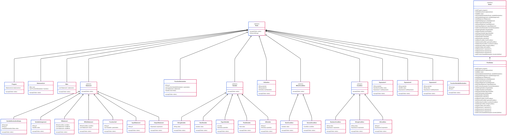

# Proyecto Compiladores - Fase II

Este proyecto implementa un compilador para el lenguaje "MyLanguage" utilizando ANTLR como herramienta para generar el analizador sintáctico y semántico.

## Estructura del Proyecto

El proyecto está organizado de la siguiente manera:

- **grammar/MyLanguage.g4**: Archivo de gramática en formato ANTLR.
- **docs/images/UML_Diagram.svg**: Diagrama UML que muestra la jerarquía de clases.
- **src/**: Contiene el código fuente del compilador.
- **examples/**: Ejemplos de programas escritos en MyLanguage.

## Gramática ANTLR (.g4)

La gramática de nuestro lenguaje está definida en el archivo `grammar/MyLanguage.g4`. Esta gramática describe la sintaxis de nuestro lenguaje, incluyendo:

- Declaración de variables
- Asignaciones
- Estructuras de control (if-else, while)
- Funciones
- Operaciones aritméticas
- Expresiones condicionales
- Entrada/salida básica

Para ver la gramática completa, consulta el archivo [MyLanguage.g4](./grammar/MyLanguage.g4).

## Diagrama de Clases UML

El siguiente diagrama muestra la jerarquía de clases implementada para representar los símbolos no terminales de nuestra gramática, siguiendo el patrón de diseño Visitor:

[⬇️ Descargar diagrama UML en formato SVG](./docs/images/Diagrama_UML.svg)

## Colaboradores:

Mario Ricardo De la Cruz Guevara 1176323 |

José Andrés García Elías 1106423 | 

Oscar Daniel Xiquin Cumes 1118423 
